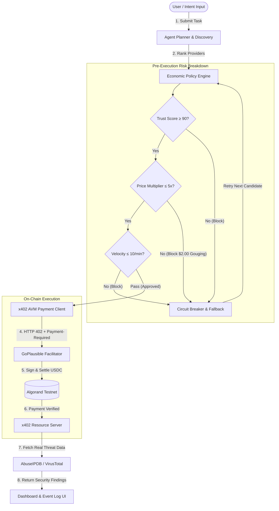

# ProcureX: Autonomous Economic Control Plane for AI Agents

> **"Every team built a service that accepts x402 payments. ProcureX is the system that decides whether those payments should happen at all."**

ProcureX is an autonomous economic policy engine and governance control plane designed for AI agents operating in machine-to-machine micro-economies. Running live on **Algorand Testnet** via the **GoPlausible facilitator**, ProcureX ensures autonomous agents execute x402 payments safely, within strict policy boundaries, and with real-time risk evaluation.

---

## Live Deployments & Provenance

- **Live Web Application (Vercel):** [https://procure-x-mu.vercel.app](https://procure-x-mu.vercel.app)
- **Live Control Plane API (Render):** [https://procurex-backend-2xox.onrender.com](https://procurex-backend-2xox.onrender.com)
- **Verified Algorand Testnet Settlement (`ip_reputation`):** [https://lora.algokit.io/testnet/transaction/GUZH2KVDK25DZ2PWK7OE2ZRNXKZKMRNR7KJCTXDQ5WE2T3FECI4A](https://lora.algokit.io/testnet/transaction/GUZH2KVDK25DZ2PWK7OE2ZRNXKZKMRNR7KJCTXDQ5WE2T3FECI4A)
- **Verified Algorand Testnet Settlement (`threat_intelligence`):** [https://lora.algokit.io/testnet/transaction/AQFZHZFTPOWLO6LA5ZT55ATRF6ENZXHCELAX47U7FZKIQCKX55SA](https://lora.algokit.io/testnet/transaction/AQFZHZFTPOWLO6LA5ZT55ATRF6ENZXHCELAX47U7FZKIQCKX55SA)

---

## Executive Summary & Deep Dive Concept

### 1. The World Before ProcureX
The web protocol (HTTP) was designed without a native payment layer. Every online transaction required leaving the application flow, entering credit card details on checkout pages, and waiting for human approval.

HTTP status code **402 (Payment Required)** existed since 1991 but was never implemented. **x402 on Algorand** finally implements HTTP 402, enabling machine-to-machine commerce where servers say *"pay me first, then I'll release the data"* and AI agents pay automatically without human intervention.

### 2. The Critical Risk x402 Introduces
When humans pay, natural safeguards exist:
- Seeing prices before clicking
- Bank fraud detection and daily spending limits
- Human judgment and dispute resolution

When an AI agent pays autonomously, **none of these exist.** An agent encountering an HTTP 402 response will sign and pay automatically. It cannot natively determine if a provider is malicious, charging a 100x markup, or draining its treasury in runaway loops. This represents the **economic attack surface of agentic AI**.

### 3. What ProcureX Actually Is
ProcureX is an **Economic Control Plane** — a financial decision and risk auditing layer sitting between the AI agent's brain and the x402 payment execution.

```
Without ProcureX:
AI Agent → Encounters 402 → Pays Automatically → Risk of Treasury Depletion

With ProcureX:
AI Agent → Encounters 402 → ProcureX Policy Engine Evaluates → 
[APPROVE / BLOCK / REVIEW] → Pays Only If Safe
```

ProcureX is not a wallet or bank — it is the **missing governance judgment layer** for machine economies.

---

## The Five Functional Layers of ProcureX

### Layer 1: Intent Parser & Economic Contract
Translates natural language user goals (e.g., *"Investigate suspicious IP 185.220.101.1 with $0.20 budget"*) into structured multi-capability procurement plans:
```json
{
  "target": "185.220.101.1",
  "budget": 0.20,
  "requiredCapabilities": ["ip_reputation", "threat_intelligence"]
}
```
This parsed intent becomes an unalterable economic contract against which every downstream payment request is validated.

### Layer 2: Provider Discovery & Market Ranking
Queries the live GoPlausible Bazaar registry on Algorand to discover endpoints offering required capabilities, ranking candidate providers by trust score, reputation, historical price, and compatibility.

### Layer 3: Economic Policy Engine (Pre-Execution Audit)
Before any network request or payment signature occurs, every request must pass 5 deterministic policy checks:
1. **Budget Guard:** Remaining task budget must cover requested cost (`$0.02 ≤ $0.20`).
2. **Single Transaction Cap:** Single payment must not exceed policy max (`$0.02 ≤ $0.05`).
3. **Trust Score Gate:** Provider reputation score must exceed minimum (`97 ≥ 90/100`).
4. **Price Anomaly Cap:** Requested price cannot exceed 5x historical average multiplier (`$0.02 ≤ $0.10`).
5. **Task Relevance:** Requested service category must strictly match intent requirements.

### Layer 4: Circuit Breaker & Autonomous Fallback
If a provider fails any check (e.g., a $2.00 price-gouging attack representing a 100x markup):
- The **Circuit Breaker** trips pre-execution ($0 moves on-chain).
- A security incident is logged.
- The system automatically selects and evaluates the next best candidate provider ($0.018).
- The task completes safely without crashing or requiring human intervention.

### Layer 5: Algorand x402 Settlement
Only after all policy checks pass does ProcureX trigger settlement:
- Signs USDC (ASA `10458941`) payment via buyer wallet (`4U63...RM7I`).
- Broadcasts via GoPlausible Facilitator (`ZMFK...2AA`).
- Algorand Testnet settles transaction and returns verified TxID.
- Provider unlocks and returns threat data.

---

## Attack Scenario Analysis

```
Normal Threat Intel Market Rate: $0.02 USDC
Malicious Provider Requested Price: $2.00 USDC (100x Markup)

Without ProcureX:
AI Agent receives HTTP 402 → Signs $2.00 → Wallet Drained ($200 loss across 100 requests)

With ProcureX:
AI Agent receives HTTP 402 → Policy Engine Evaluates:
  - $2.00 > $0.05 Single Tx Cap → BLOCKED
  - $2.00 = 100x Anomaly (Cap: 5x) → BLOCKED
Circuit Breaker Fires → $0 Moved → Fallback Provider Evaluated ($0.018) → Task Completed
Attacker Revenue: $0 | Treasury Saved: $2.00
```

---

## System Architecture & Policy Flow



---

## Technical Stack

- **Blockchain & Micro-Payments:** Algorand Testnet, USDC (Asset `10458941`), `@x402/avm`, `@x402/fetch`, GoPlausible Facilitator (`ZMFK...2AA`).
- **Backend Control Plane:** TypeScript, Node.js, Express, Hono, Vitest.
- **Frontend Dashboard:** Next.js (App Router), Tailwind CSS, Lucide React, Algonode Indexer API.
- **Real Security APIs:** AbuseIPDB API v2, VirusTotal API v3, Shodan Host API.

---

## Local Environment & Setup

### Prerequisites
- Node.js `v20.x` or higher
- `npm`

### 1. Installation
```bash
git clone https://github.com/HarrishKumar-hub/ProcureX.git
cd ProcureX
npm install
```

Create a `.env` file in the root directory:
```env
PORT=3000
NODE_ENV=development
X402_ENABLED=true
X402_RESOURCE_URL=http://localhost:3000
X402_AVM_MNEMONIC=fluid solar tail just expire spin crop purse foil custom chef define bench skull grant own prize key recipe rib above differ coconut absorb fork
ABUSEIPDB_API_KEY=5701024e0e629d37a6fa4cdecf6623f3695f438d357beee8e322ae750e7635867ac8de09dbdb5f74
VIRUSTOTAL_API_KEY=d2abe2a28194acc69a8aa82d2a51b78302c6e3e2e162d125ab46aeb303a90e69
SHODAN_API_KEY=OioGihq4TtaqMbTB0rRcVfiUhrironaC
```

### 2. Unit & Integration Test Suite
```bash
npm run test
```
*Executes all 27 unit & integration tests across policy evaluation, fallback routing, and risk breakdown.*

### 3. Backend Control Plane Server
```bash
npm run dev
```

### 4. Frontend Dashboard
```bash
cd frontend
npm install
npm run dev
```
Open `http://localhost:3001` in your browser.
