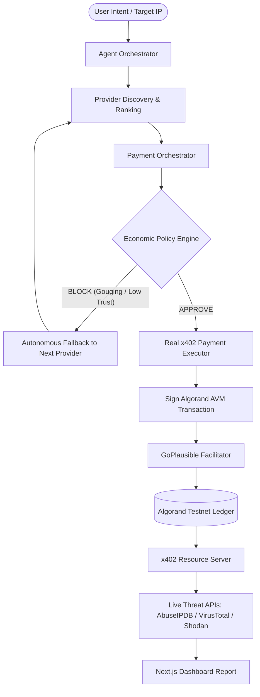

# ProcureX — Economic Control Plane for Autonomous AI

ProcureX is an economic policy engine and orchestrator that sits between AI agent orchestrators and x402-paid API providers. It evaluates every payment request against budget, trust, and anomaly rules BEFORE authorizing real settlement — approving legitimate transactions and blocking attacks with zero wasted funds.

[](https://opensource.org/licenses/MIT)
[](https://lora.algokit.io/testnet)
[](https://facilitator.goplausible.xyz)

---

## 🎯 The Problem

As autonomous AI agents are equipped with crypto wallets to pay for data and microservices via **x402**, nothing stops them from overspending, getting price-gouged by malicious endpoints, or draining funds on dead-end API calls. **Payment capability without payment judgment is a liability, not a feature.**

## 🛡️ The Solution

ProcureX introduces an **Economic Control Plane** that intercepts agent payment requests. It evaluates trust scores, historical pricing, velocity limits, and remaining task budgets before authorizing transactions:
- **Approved payments** are executed via client-side signed x402 transactions settled on Algorand Testnet.
- **Malicious/gouged requests** are **BLOCKED on-policy** — preventing any on-chain funds from being spent and preventing any API calls from firing.
- **Autonomous Fallback:** If a provider is blocked, ProcureX automatically routes to the next best legitimate provider.

---

## 🚀 USP — What Makes ProcureX Different

1. **Pre-Execution Policy Gating:** ProcureX blocks attacks *before* x402 settlement. Malicious providers get $0.00 and 0 API hits — proven via our built-in Attack Simulator.
2. **Real Algorand Testnet x402 Settlement:** Transactions are cryptographically signed using `@x402/avm` (Exact Scheme with sponsored gasless fee payers) and settled via the public **GoPlausible facilitator**.
3. **Live Threat Intelligence:** Once payment settles, endpoints fetch live, real-time data from **AbuseIPDB, VirusTotal, and Shodan** — no mock data.
4. **Autonomous Multi-Provider Fallback:** If a high-priced or compromised provider is blocked, the agent seamlessly fails over to the next candidate provider without human intervention.

> *"x402 gives agents the ability to pay. ProcureX gives them the judgment to decide whether they should."*

---

## 🏗️ Architecture



### End-to-End Walkthrough
1. **User Intent:** User submits a target IP to investigate (e.g. `185.220.101.1`).
2. **Agent Orchestration:** Agent breaks intent into required capabilities (`ip_reputation`, `threat_intelligence`, `malware_analysis`).
3. **Provider Discovery:** Ranks available candidate endpoints based on trust score, reputation, and price.
4. **Policy Evaluation:** Intercepts payment request and evaluates policy rules (budget, price markup, velocity).
5. **Execution / Fallback:**
   - If **BLOCKED** (e.g., Attack Simulator 100x price markup), no funds or API requests are made; orchestrator switches to the fallback provider.
   - If **APPROVED**, `RealPaymentExecutor` signs the AVM transaction group, sends it over x402 header to the resource server, and settles via GoPlausible.
6. **Live Data Fetch:** Resource server verifies settlement and queries AbuseIPDB / VirusTotal / Shodan, surfacing real findings in the dashboard.

---

## 🔗 Real x402 Transaction Proof

Verified on Algorand Testnet via Lora Explorer:
- 🔗 **[GUZH2KVDK25DZ2PWK7OE2ZRNXKZKMRNR7KJCTXDQ5WE2T3FECI4A](https://lora.algokit.io/testnet/transaction/GUZH2KVDK25DZ2PWK7OE2ZRNXKZKMRNR7KJCTXDQ5WE2T3FECI4A)** (`ip_reputation` payment — $0.01 USDC)
- 🔗 **[AQFZHZFTPOWLO6LA5ZT55ATRF6ENZXHCELAX47U7FZKIQCKX55SA](https://lora.algokit.io/testnet/transaction/AQFZHZFTPOWLO6LA5ZT55ATRF6ENZXHCELAX47U7FZKIQCKX55SA)** (`threat_intelligence` payment — $0.02 USDC)

*Settled live through the GoPlausible facilitator (`https://facilitator.goplausible.xyz`).*

---

## 🛠️ Tech Stack

- **Backend:** Node.js, TypeScript, Express, Hono
- **x402 Protocol:** `@x402/core`, `@x402/avm`, `@x402/fetch`, `@x402/hono`
- **Blockchain:** Algorand Testnet (USDC Asset `10458941`)
- **Facilitator:** GoPlausible (`https://facilitator.goplausible.xyz`)
- **Frontend:** Next.js (App Router), Tailwind CSS, Lucide Icons
- **Threat Intelligence:** AbuseIPDB, VirusTotal, Shodan APIs

---

## 💻 Running Locally

### Prerequisites
- Node.js 18+
- An Algorand Testnet wallet (25-word mnemonic) funded with Testnet ALGO and opted into USDC (`10458941`).
- Free API keys from AbuseIPDB, VirusTotal, and Shodan.

### 1. Installation
```bash
git clone https://github.com/HarrishKumar-hub/ProcureX.git
cd ProcureX
npm install
cd frontend && npm install && cd ..
```

### 2. Environment Configuration
Copy `.env.example` to `.env` and fill in your keys:
```bash
cp .env.example .env
```
```env
X402_AVM_MNEMONIC="your 25-word testnet mnemonic"
AVM_ADDRESS="your-algorand-testnet-receiver-address"
FACILITATOR_URL="https://facilitator.goplausible.xyz"
PORT=3000
RESOURCE_SERVER_PORT=4021
X402_ENABLED=true
X402_RESOURCE_URL=http://localhost:4021

ABUSEIPDB_API_KEY=your_abuseipdb_key
VIRUSTOTAL_API_KEY=your_virustotal_key
SHODAN_API_KEY=your_shodan_key
```

### 3. Launch Services (3 Terminals)

**Terminal 1 — x402 Resource Server (Port 4021):**
```bash
npm run dev:provider
```

**Terminal 2 — Backend API (Port 3000):**
```bash
npm run dev
```

**Terminal 3 — Frontend Dashboard (Port 3001):**
```bash
cd frontend && npm run dev
```

Open `http://localhost:3001` in your browser, enter `185.220.101.1`, and click **Run Investigation**.

---

## 🔑 Free API Key Sign-up Links

- **AbuseIPDB:** [https://www.abuseipdb.com/register](https://www.abuseipdb.com/register) (1,000 checks/day free)
- **VirusTotal:** [https://www.virustotal.com/gui/join-us](https://www.virustotal.com/gui/join-us) (500 checks/day free)
- **Shodan:** [https://account.shodan.io/register](https://account.shodan.io/register) (100 checks/month free)

---

## 📜 License

MIT License. See `LICENSE` for details.
